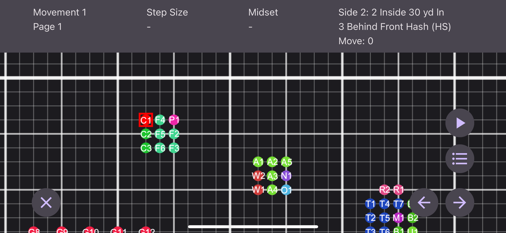
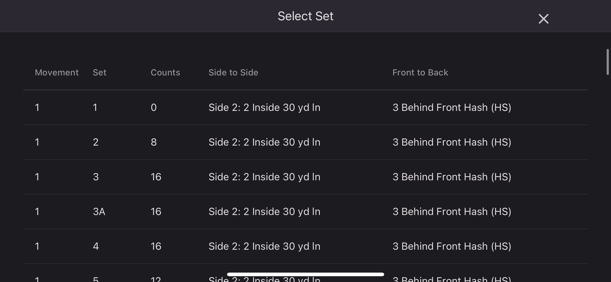
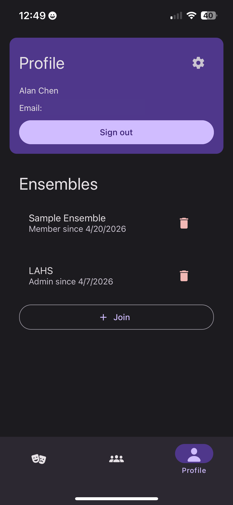
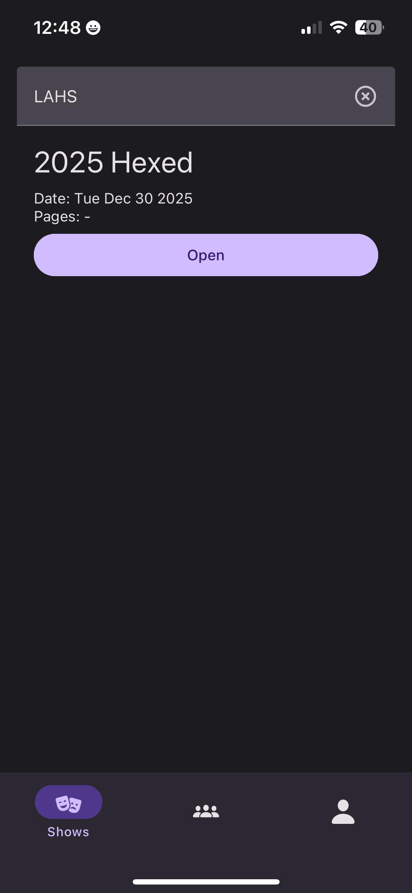
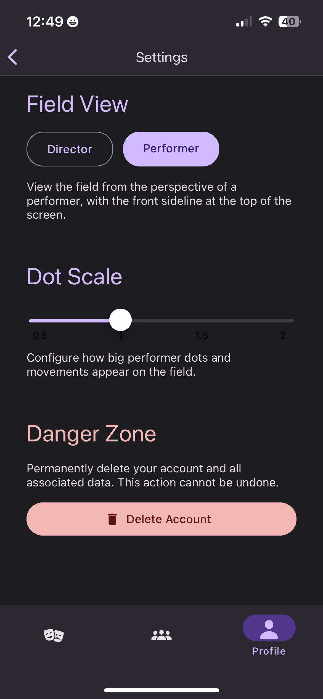
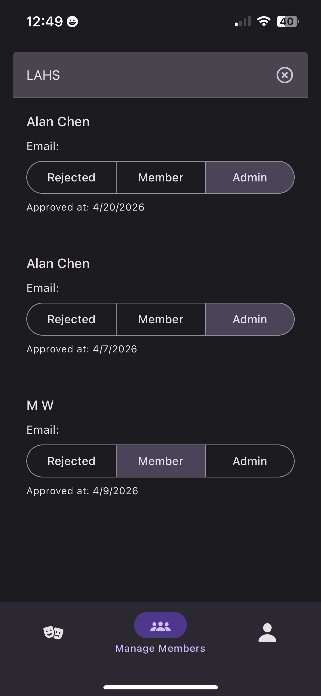

# PocketBook

PocketBook is a drill visualizer for marching band drill, which is essentially just a series of formations that a
marching band performs on a field. This project is specifically created around a high-school football field, and was
actually extensively used by my section members and I the past season. Enjoy!

> [!NOTE]
> Access pocketbook on Apple TestFlight [here](https://testflight.apple.com/join/h8qeypdj)

## Features/Screenshots

<table>
    <tr>
        <td>
            Visualize everything on the field 
            
        </td>
        <td>
            Find your dots in a press 
            
        </td>
    </tr>
    <tr>
        <td>
            Join as many ensembles as you want 
            
        </td>
        <td>
            Have all your shows in one place 
            
        </td>
    </tr>
    <tr>
        <td>
            Customize your settings 
            
        </td>
        <td>
            Manage your ensemble members 
            
        </td>
    </tr>
</table>

This app has been heavily influenced by all of my friends in Marching Band, who have kindly provided feedback on ways
that I can improve the app. If you have any suggestions, please let me know!
